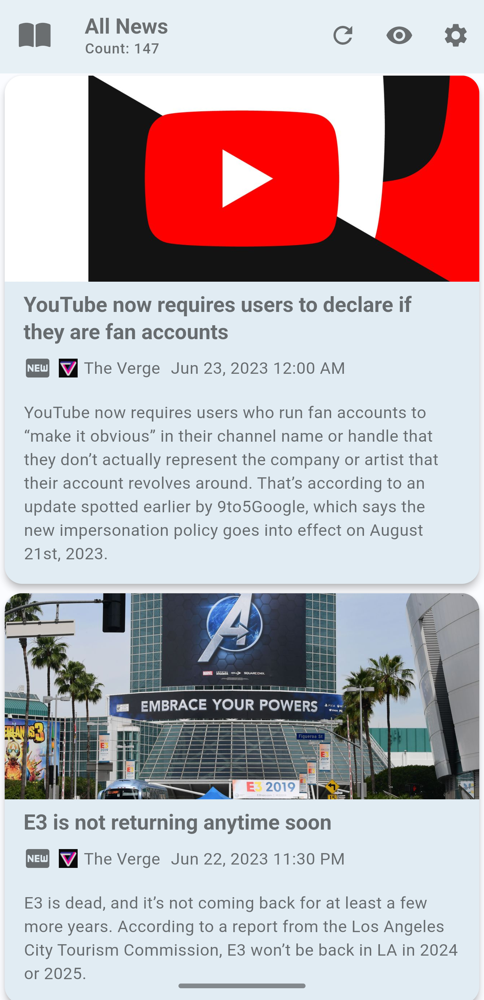
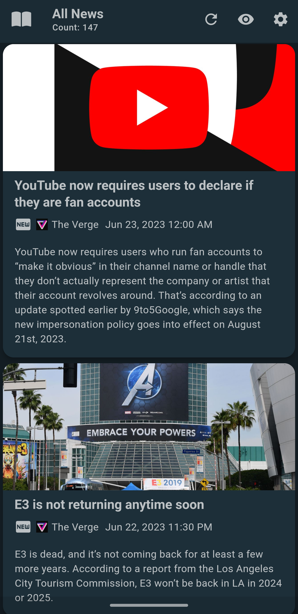
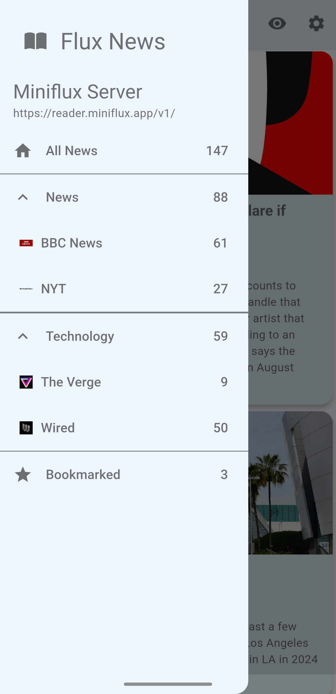
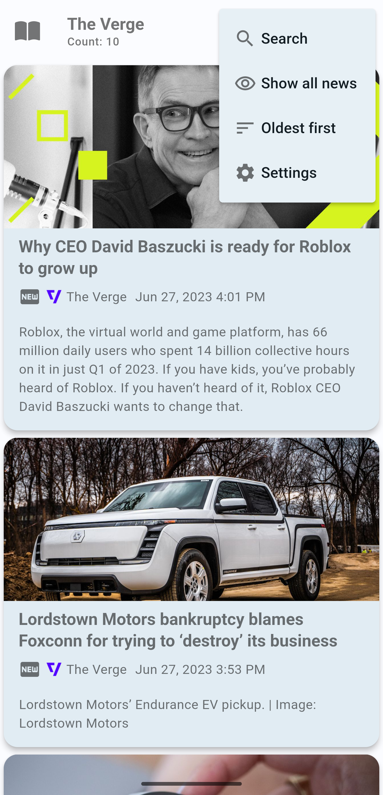
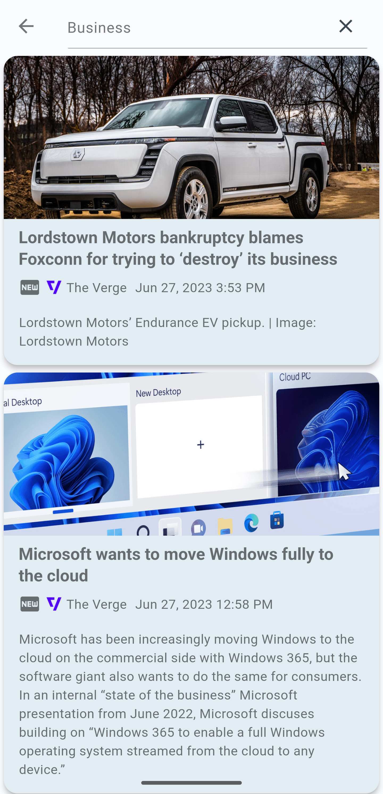
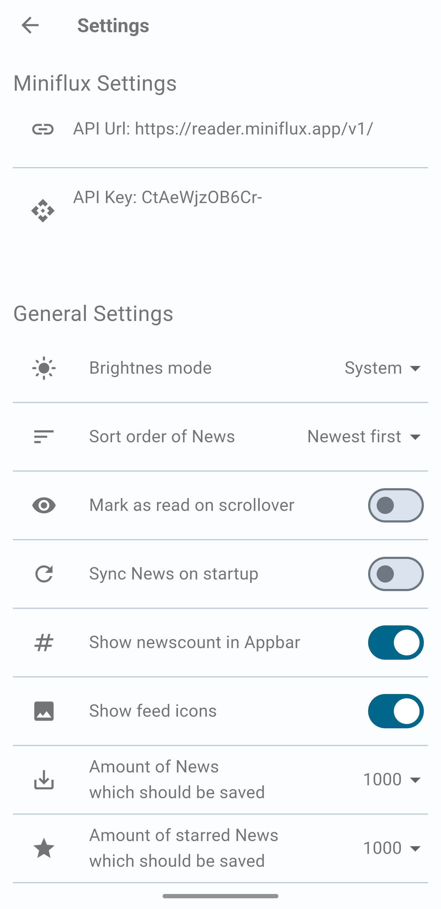

# Flux News

A simple Newsreader for the miniflux backend (<https://miniflux.app>).

This newsreader sync with the miniflux server api.

It supports light and dark mode, mark articles as read on scrollover and open articles preferred in an already installed app.
  

## Download

## Getting Started

Flux News requires Miniflux version >= [2.0.29](https://miniflux.app/releases/2.0.29.html).

1. In Miniflux, create an API key in Settings / API Keys.
2. Open the app, go to the Settings page
3. Add the server URL and the key (do **include** the `/v1/` part of the URL endpoint)
4. Save, go back and refresh!

The unread articles should appear in the app.

## Screenshots

  

## Features

Flux News is still in development but implements some common features for an RSS reader. Keep in
mind that this is a personal project which is moving forward depending on my free time. At the
moment, the following is supported:

**Dark Mode:** Flux News has a material design inspired look in either light or dark themes.

**Search for articles:** Search for articles at the miniflux backend.

**Mark as read on scrollover:** Articles are marked as read when you scroll over them.

**Open articles in an app:** Articles can be opened in an already installed app.

**Order articles by date:** Articles can be ordered by date ascending or descanding.

**Filter articles by status:** Articles can be filtered by status (unread, read, starred).

**Filter articles by category:** Articles can be filtered by category.

**Filter articles by feed:** Articles can be filtered by feed.
  

## Limitations:

- Being online is required (no fetching for offline reading).
- No user management.
- No feed or category management.

## Permissions

* Internet permission is required to sync with the miniflux backend.
  

## Disclaimer

This program is free software: you can redistribute it and/or modify it under the terms of the Modified BSD License.

This program is distributed in the hope that it will be useful, but WITHOUT ANY WARRANTY; without even the implied warranty of MERCHANTABILITY or FITNESS FOR A PARTICULAR PURPOSE. See the Modified BSD License for more details.
