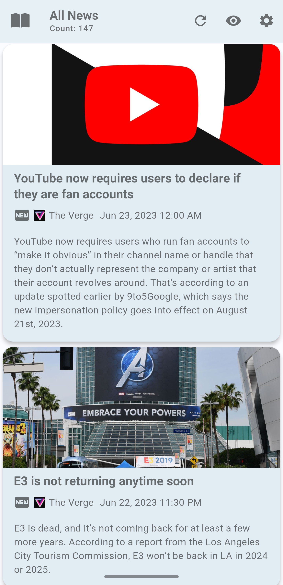
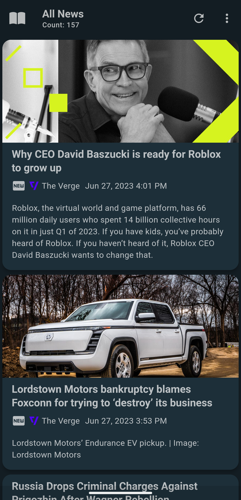
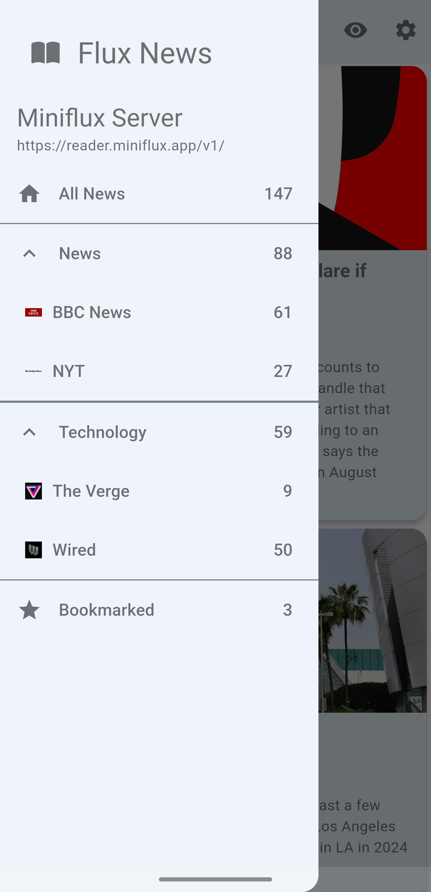
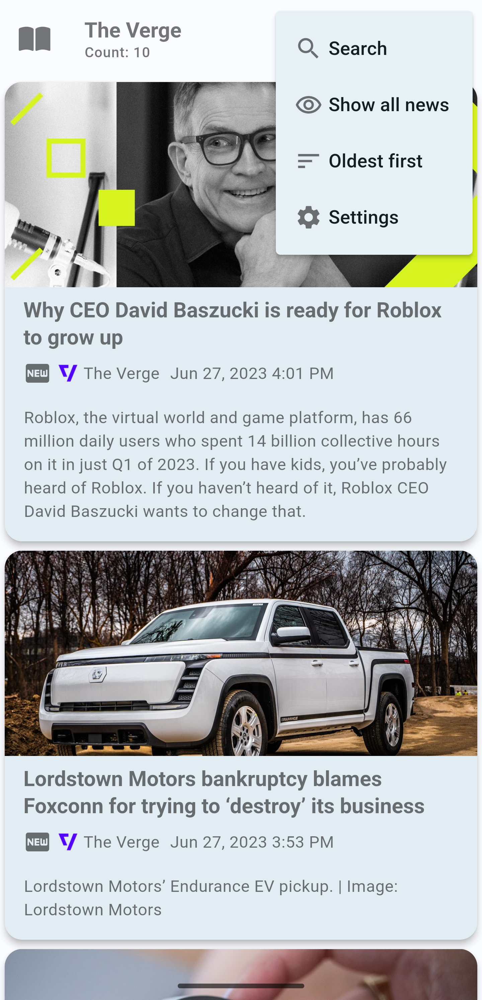
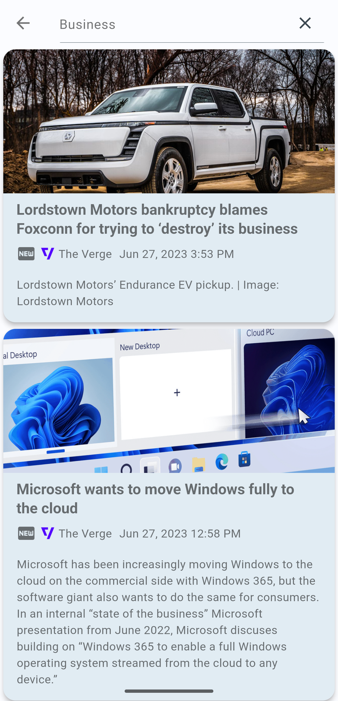
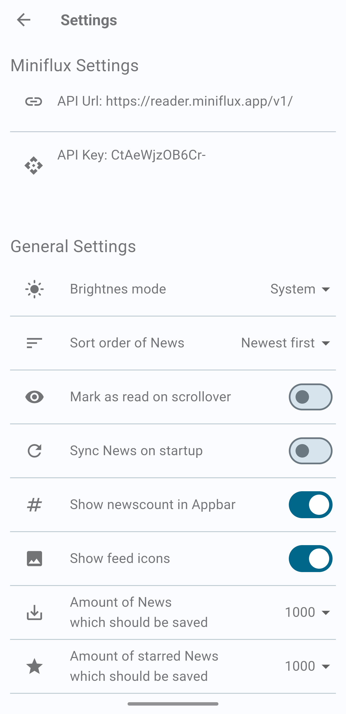
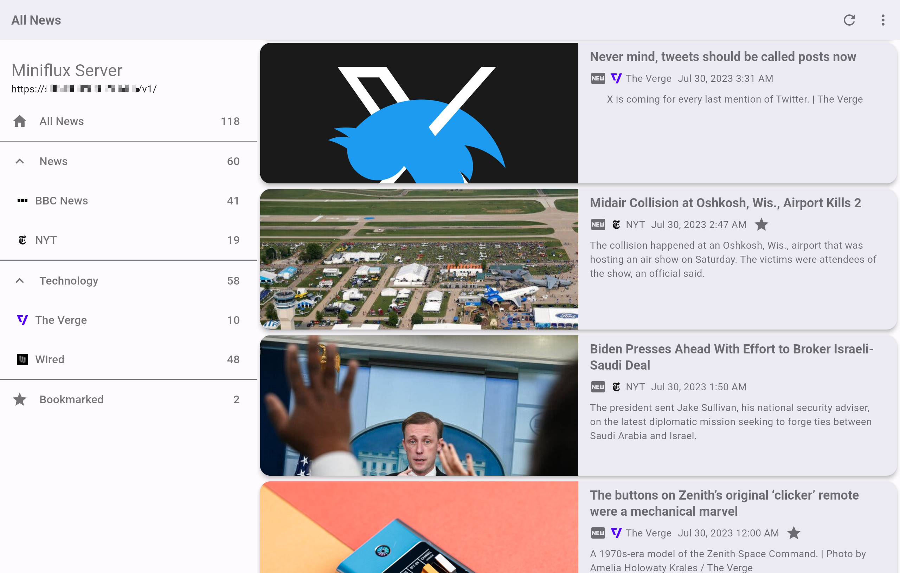
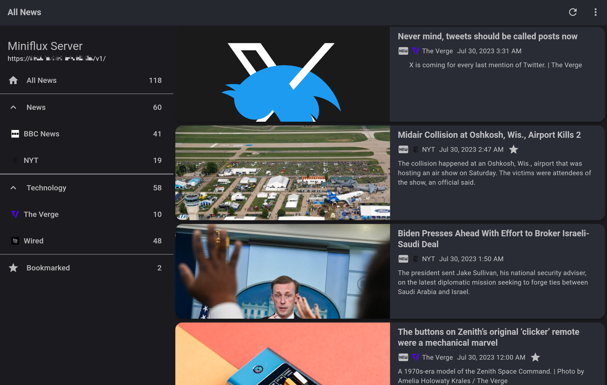
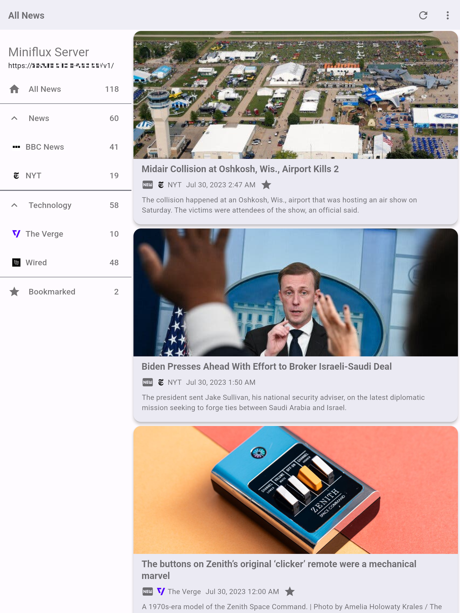

# Flux News & Podcasts

A privacy-first Newsreader and Podcast player for the Miniflux backend ([https://miniflux.app](https://miniflux.app)). 

Flux News synchronizes seamlessly with the Miniflux API to bring your favorite articles and podcasts to all your devices—including your car.

Enjoy full offline support, intuitive gestures, a true OLED black mode, and a powerful new media engine for an uninterrupted listening experience.

## Download

## Getting Started

Flux News requires Miniflux version >= [2.0.29](https://miniflux.app/releases/2.0.29.html).

1. In Miniflux, create an API key in Settings / API Keys.
2. Open the app, add the server URL and the key you just created.
3. Save, go back and refresh!

The unread articles should appear in the app.

## Screenshots
### Phone

### Tablet

  

## Features

### 🗞 News Reading
* **Full Offline Support:** Read the fetched article text anytime, anywhere.
* **Intuitive Gesture Control:** Navigate your news with natural swipe gestures. Quickly triage your articles, mark them as read, or save them for later.
* **Mark as Read on Scroll:** Articles are automatically marked as read when you scroll over them.
* **OLED-Optimized Design:** Choose between Light, Dark, and a specialized true black mode for OLED screens.
* **Precision Filtering & Search:** Instantly sort through your content by status, category, or individual feeds. 
* **Native Experience:** Open articles in their respective installed apps or access comments directly.
* **Article Management:** Support for truncating articles and sending them to third-party services.

### 🎙 Podcast Excellence (New!)
* **Integrated Player:** High-performance playback with variable speed control.
* **Smart Management:** Automatic download of new episodes and automatic deletion after finishing to save storage.
* **Advanced Audio Features:** Full chapter recognition for easy navigation and a built-in sleep timer.
* **Backend Sync:** Your playback progress is synchronized with your Miniflux backend.
* **Dedicated Downloads View:** Access and manage all your offline audio content in one convenient view.

### 🚗 On the Road (New!)
* **CarPlay & Android Auto:** A safe, audio-centric interface designed specifically for your vehicle's dashboard.
* **Seamless Integration:** Access your podcast library and control playback safely while driving using native car controls.

## Limitations:

* **No User Management:** Please use the Miniflux web interface for managing users.
* **No Feed or Category Management:** Please use the Miniflux web interface for managing feeds and categories.

## Permissions
* **Internet:** Required to sync with your Miniflux backend.
* **Foreground Service:** Essential for stable audio playback and reliable Android Auto / CarPlay integration.
  

## Disclaimer

This program is free software: you can redistribute it and/or modify it under the terms of the Modified BSD License.

This program is distributed in the hope that it will be useful, but WITHOUT ANY WARRANTY; without even the implied warranty of MERCHANTABILITY or FITNESS FOR A PARTICULAR PURPOSE. See the Modified BSD License for more details.
